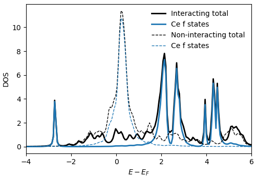

.. _ce:

DFT+DMFT example for Ce with VASP
===================================

Here we perform a DFT+DMFT calculation for Ce in its high temperature gamma phase, as discussed, e.g., in references `[1] <https://doi.org/10.1088/0953-8984/24/7/075604>`_ and as a tutorial in dft_tools for charge self consistent DFT+DMFT calculations with Wien2K and the old Hubbard-I version 1.4. For simplicity, we do no charge self-consistency. We rely on DFT calculations done with VASP and the VASP interface to triqs implemented in the `dft_tools app <https://triqs.github.io/dft_tools/latest/index.html>`_. For all DFT related details have a look in the detailed documentation of dft_tools and especially the VASP interface.

We perform a VASP calculation with input files :ref:`INCAR`, :ref:`KPOINTS`, :ref:`POSCAR`, and an appropriate `POTCAR`. Non standard flags in the `INCAR` are::

  LORBIT = 14
  EMIN = 0
  EMAX = 14
  LOCPROJ = 1 : f : Pr 1
  ISYM = -1
  
These select a special way of calculating projectors which optimize the overlap of bands in an energy window (`EMIN` and `EMAX`) and the Ce f states. We also switch off all symmetries (`ISYM=-1`).

After executing `VASP` we orthonormalize the raw projectors in the VASP output using `plovasp` and a corresponding input file :download:`plo.cfg <ce_input/plo.cfg>` which selects the correlated subspace and an energy window in which the orthonormalization is done::

  plovasp plo.cfg

We convert the `plovasp` output to a h5 archive called `ce.h5` using the script :download:`converter.py <ce_input/converter.py>` which serves as an input to triqs/dft_tools::
  
  python converter.py

We can finally perform the dmft loop using a quite plain setup as implemented in the script :download:`ce.py <ce_input/ce.py>`::

  python ce.py

For each iteration we calculate the self energy on Matsubara frequencies and the real axis by the `calc_gw` flag::

  S.solve(h_int = H, calc_gw=True )
  
All results are saved in the archive `ce.h5`. To compare with results from literature, let us calculate the local lattice green function. We use the script :download:`ce_local_lattice.py <ce_input/ce_local_lattice.py>`, where we load the self energy on the real axis from the last dmft iteration and plug it into the equation for the lattice green function. The result is again saved in the archive. Let's look at the result, which can, e.g., be generated by the script :download:`plot_dos.py <ce_input/plot_dos.py>`.

We can nicely see, that the non-interacting DOS shows a large density of states close to the Fermi energy and that these states mostly consist of Ce f states. Including local atomic interactions leads to a splitting of these states into multipletts, which end up far away from the Fermi energy.
