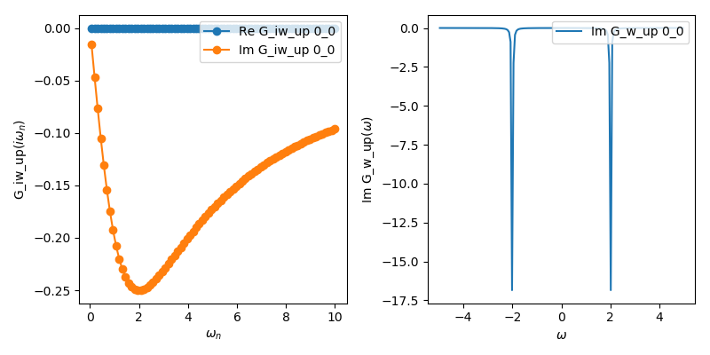

.. _single_band:

Single band Anderson impurity model
===================================

Here is the implementation for an Anderson impurity model with a flat (Wilson) hybridization function.

.. code-block:: python

   from triqs_hubbardI import *
   from h5 import *
   from triqs.gf import *
   from triqs.operators import *
   from triqs.utility.h5diff import h5diff
   from h5 import HDFArchive
   
   D, V, U = 1.0, 0.2, 4.0
   e_f, beta = -U/2.0, 50

   # initialize the solver
   S = Solver(beta = beta, gf_struct = [ ('up',[0]), ('down',[0]) ],idelta=0.5)

   # set the non-interacting Green's function
   for name, g0 in S.G0_iw: g0 << inverse(iOmega_n - e_f - V**2 * Wilson(D))

   # solve the atomic problem
   S.solve( h_int = U * n('up',0) * n('down',0), calc_gw = True )

   # Save the results in an HDF5 file (only on the master node)
   with HDFArchive("aim_solution.h5",'w') as Results:
        Results["G_iw"] = S.G_iw
        Results["G_w"] = S.G_w

Take note of ``calc_gw = True`` in calling the solver, which also calculates the Green's function on real frequencies.

Let us plot the result by

.. code-block:: python
		
	from triqs.gf import *
	from h5 import *
	from triqs.plot.mpl_interface import oplot

	with HDFArchive('aim_solution.h5','r') as ar:
		oplot(ar['G_iw']['up'], '-o', x_window = (0,10))
	with HDFArchive('aim_solution.h5','r') as ar:
		oplot(ar['G_w']['up'].imag, '-', x_window = (-5,5))

which should result in something like this:

The Green function is actually quite close to the cthyb result (compare the equivalent example in the documentation of the `ctyhb app <https://triqs.github.io/cthyb/latest/guide/aim.html>`_). The spectral function shows peaks at the atomic energies at plus and minus U/2. 
